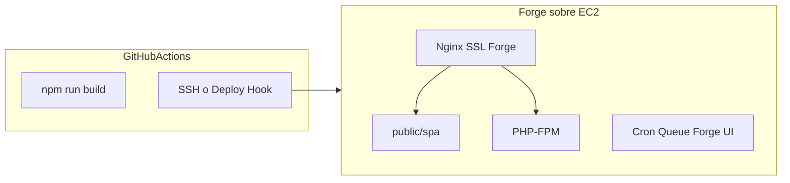

# Plan A — Variante A + Laravel Forge + GitHub Actions

| Campo | Valor |
|-------|--------|
| **Ámbito** | Despliegue AWS — backend + frontend mismo sitio |
| **Plataforma** | Laravel Forge sobre EC2 |
| **CD** | GitHub Actions (build React) + Forge/SSH (release) |
| **Variante UI** | A — SPA en `backend/public/spa/` |
| **Staging espejo** | Ver [PLAN-deploy-staging-espejo-produccion.md](PLAN-deploy-staging-espejo-produccion.md) |

## Objetivo

Desplegar **backend (Laravel) + frontend (React build estático)** en **un solo dominio**, sin Node en el servidor de producción.

- Dominio único: `https://pedidosweb.cliente.com`
- API: `/api/v1/*`
- UI: archivos estáticos en `backend/public/spa/`
- Build React: **solo en GitHub Actions** (Forge no compila Vite)

## Arquitectura



## Variante A (común a ambos planes)

| Item | Valor |
|------|--------|
| Vite `outDir` | `../backend/public/spa` |
| Vite `base` | `/spa/` |
| CI `VITE_API_BASE_URL` | `/api/v1` |
| React Router | `BrowserRouter` sin `basename` |
| Nginx | `try_files` → `/spa/index.html` para rutas no-API |

Referencia código: [`frontend/src/shared/http/client.ts`](../../../frontend/src/shared/http/client.ts) ya soporta API relativa.

## Configuración Forge (una vez)

| Campo Forge | Valor |
|-------------|--------|
| Repositorio | Monorepo completo (`PaqSuite-IA-PedidosWeb`) |
| **Web Directory** | **`backend/public`** |
| PHP | 8.1+ con extensiones Laravel + **`pdo_sqlsrv`** |
| Ruta típica | `/home/forge/pedidosweb.dominio.com` |
| Node en server | **No** (desactivar npm/yarn en deploy Forge) |

### Nginx en Forge

Editar sitio → Nginx → agregar/verificar:

```nginx
location /api {
    try_files $uri $uri/ /index.php?$query_string;
}
location / {
    try_files $uri $uri/ /spa/index.html;
}
```

### `.env` en Forge (Environment)

- `APP_URL` = URL pública
- `FRONTEND_URL` = misma URL (same-origin)
- `DB_CONNECTION=sqlsrv` + host/credenciales SQL Server
- `TENANT_*`, mail, `SEED_MVP_PASSWORD` solo dev

**Nunca** ejecutar en deploy: `paqsuite:bootstrap-pedidosweb-dev` ni scripts destructivos.

## Cambios en el repositorio

### 1. Frontend build

[`frontend/vite.config.ts`](../../../frontend/vite.config.ts): `outDir`, `base`, gitignore `backend/public/spa/`.

### 2. Laravel SPA fallback

[`backend/routes/web.php`](../../../backend/routes/web.php): catch-all respaldo (excluir `/api/*`, OpenAPI, storage).

### 3. Script de release

[`deploy/release-forge.sh`](../../../deploy/release-forge.sh):

```bash
cd backend
composer install --no-dev --optimize-autoloader
php artisan migrate --force
php artisan config:cache && route:cache && view:cache
php artisan queue:restart
```

### 4. Deploy script Forge

En el panel Forge → Deployment Script:

```bash
cd /home/forge/SITIO
git pull origin $FORGE_SITE_BRANCH
# NO npm aquí — el SPA llega vía GHA o rsync previo
cd backend && bash ../deploy/release-forge.sh
```

**Opción preferida:** Forge solo hace `git pull` + `release-forge.sh`; **GHA** sube `public/spa/` por rsync **antes** del hook, o GHA dispara deploy hook tras rsync.

### 5. GitHub Actions

[`.github/workflows/deploy-forge.yml`](../../../.github/workflows/deploy-forge.yml):

1. `npm ci` + `npm run build` en `frontend/` (secrets: `VITE_DEVEXTREME_LICENSE`, tenant)
2. Validación opcional: `composer test` filtrado
3. `rsync` de `backend/public/spa/` al server Forge
4. `rsync` código PHP o `git pull` remoto
5. SSH: ejecutar `deploy/release-forge.sh`
6. **Opcional:** `curl` al Deploy URL de Forge

**Secrets:** `FORGE_HOST`, `FORGE_USER` (forge), `FORGE_SSH_KEY`, `FORGE_PATH`, `VITE_DEVEXTREME_LICENSE`

## Fases de implementación

1. Repo: vite + web.php + release-forge.sh
2. Forge: web directory, nginx, `.env`, sqlsrv
3. GHA manual (`workflow_dispatch`)
4. CD en push + GitHub Environment `staging` → prueba en espejo → `production` con aprobación (ver [PLAN-deploy-staging-espejo-produccion.md](PLAN-deploy-staging-espejo-produccion.md))

## Ventajas (para debatir)

- Panel Forge: SSL Let's Encrypt, cron, queue workers, logs, reinicios PHP en clicks
- Equipo Laravel ya familiarizado con Forge
- Menos sysadmin que EC2 bare metal
- Mismo monorepo resuelto con Web Directory + GHA build

## Desventajas (para debatir)

- Costo suscripción Forge + EC2
- Lógica repartida: Forge UI + scripts repo + GHA (tres lugares)
- Monorepo no es el caso feliz de Forge (ajustes manuales iniciales)
- Nginx custom a veces pelea con regeneración automática Forge
- Vendor lock-in moderado al panel

## Coste operativo estimado

- Forge: ~USD 12–19/mes + EC2 (t3.small ~USD 15–25/mes)
- Tiempo setup inicial: **bajo–medio** si ya tienen Forge

## Criterio de éxito

- `GET /api/v1/health` → OK
- Login UI + carga comprobante
- Deploy repetible desde GHA sin npm en server
- Sin scripts destructivos en pipeline

## Checklist de tareas

- [ ] vite.config → backend/public/spa + gitignore
- [ ] web.php catch-all SPA (excluir /api)
- [ ] deploy/release-forge.sh (composer, migrate, cache)
- [ ] Configurar Forge: web directory backend/public, nginx, .env sqlsrv
- [ ] .github/workflows/deploy-forge.yml (build + rsync spa + release)
- [ ] Primer deploy manual; luego CD con environment production
