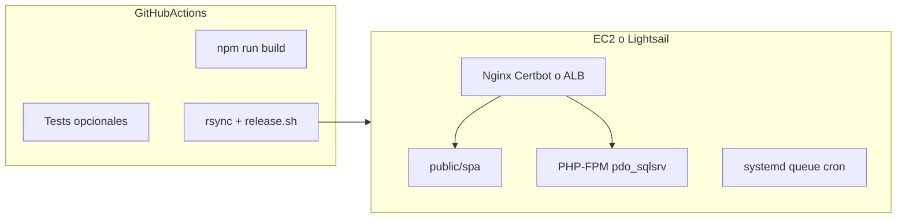

# Plan B — Variante A + EC2/Lightsail + GitHub Actions (sin Forge)

| Campo | Valor |
|-------|--------|
| **Ámbito** | Despliegue AWS — backend + frontend mismo sitio |
| **Plataforma** | EC2 o Lightsail (sin Laravel Forge) |
| **CD** | GitHub Actions (build + rsync + release) |
| **Variante UI** | A — SPA en `backend/public/spa/` |
| **Staging espejo** | Ver [PLAN-deploy-staging-espejo-produccion.md](PLAN-deploy-staging-espejo-produccion.md) |

## Objetivo

Desplegar **backend + frontend** en **un solo dominio**, sin Laravel Forge.

- Dominio único: `https://pedidosweb.cliente.com`
- API: `/api/v1/*`
- UI: `backend/public/spa/` (build estático)
- Build React: **solo GitHub Actions**
- Infra server: **versionada en `deploy/`** (Nginx, bootstrap, release)

## Arquitectura



## Variante A (idéntica al Plan A)

| Item | Valor |
|------|--------|
| Vite `outDir` | `../backend/public/spa` |
| Vite `base` | `/spa/` |
| CI `VITE_API_BASE_URL` | `/api/v1` |
| Nginx root | `/var/www/pedidosweb/backend/public` |
| Fallback UI | `try_files ... /spa/index.html` |

## Bootstrap servidor (una vez)

[`deploy/bootstrap-ec2.sh`](../../../deploy/bootstrap-ec2.sh) — Ubuntu 22.04 o Amazon Linux 2023:

| Paso | Acción |
|------|--------|
| VM | EC2 t3.small+ o Lightsail 2GB; SG con 80/443/22 |
| PHP | 8.1+, Laravel extensions, **`pdo_sqlsrv` / ODBC Driver 18** |
| Nginx | Copiar [`deploy/nginx/pedidosweb.conf`](../../../deploy/nginx/pedidosweb.conf) |
| App path | `/var/www/pedidosweb` (clone monorepo) |
| Usuario | `deploy` con SSH key para GHA |
| SSL | Certbot `--nginx` o ALB + ACM |
| Cron | `* * * * * php artisan schedule:run` |
| Queue | `systemd` unit `queue:work` |
| `.env` | Solo en server (sqlsrv, TENANT, mail) |

Nginx clave:

```nginx
root /var/www/pedidosweb/backend/public;
location /api {
    try_files $uri $uri/ /index.php?$query_string;
}
location / {
    try_files $uri $uri/ /spa/index.html;
}
```

## Cambios en el repositorio

### 1–2. Frontend + Laravel

Igual Plan A: [`frontend/vite.config.ts`](../../../frontend/vite.config.ts), [`backend/routes/web.php`](../../../backend/routes/web.php).

### 3. Script de release

[`deploy/release.sh`](../../../deploy/release.sh) — mismo contenido que Plan A (sin npm; nunca bootstrap destructivo).

### 4. GitHub Actions

[`.github/workflows/deploy-aws.yml`](../../../.github/workflows/deploy-aws.yml):

1. Checkout monorepo
2. Node 20 → `frontend/`: `npm ci`, `npm run build`
3. Opcional: `backend/`: tests PHPUnit filtrados
4. SSH/rsync a `AWS_DEPLOY_PATH`:
   - Excluir: `.env`, `vendor/`, `storage/logs/*`
   - Incluir: código PHP + `backend/public/spa/`
5. Remoto: `bash deploy/release.sh`

**Secrets:** `AWS_DEPLOY_HOST`, `AWS_DEPLOY_USER`, `AWS_DEPLOY_SSH_KEY`, `AWS_DEPLOY_PATH`, `VITE_DEVEXTREME_LICENSE`

**Environments:** `staging`, `production` (aprobación manual en prod).

## Fases de implementación

1. Repo: vite + web.php + deploy/nginx + release.sh
2. EC2 bootstrap + `.env` + validar sqlsrv y `/api/v1/health`
3. GHA `workflow_dispatch`
4. CD en push: `staging` (espejo + QA) → `production` con aprobación manual (ver [PLAN-deploy-staging-espejo-produccion.md](PLAN-deploy-staging-espejo-produccion.md))

## Ventajas (para debatir)

- **Todo en git**: Nginx, bootstrap, release — reproducible y auditable
- **Monorepo nativo**: sin pelear Web Directory en panel
- Sin costo Forge; solo EC2/Lightsail
- Un solo flujo mental: GHA construye, rsync despliega
- Migración natural a **ECS Docker** (fase 2) sin cambiar Variante A

## Desventajas (para debatir)

- **Vosotros** mantenéis SSL, updates PHP, Nginx, cron, queues (o scripts)
- Curva sysadmin mayor que Forge
- Sin UI de logs/reinicio PHP (SSH + journalctl)
- Bootstrap inicial sqlsrv en Linux puede requerir más tiempo

## Coste operativo estimado

- EC2 t3.small: ~USD 15–25/mes (sin Forge)
- Lightsail 2GB: ~USD 10–12/mes fijo
- Tiempo setup inicial: **medio** (bootstrap + sqlsrv)
- Mantenimiento mensual: **medio** (patches OS/PHP)

## Criterio de éxito

Idéntico Plan A: health, login, carga, deploy repetible GHA, cero npm en prod.

## Migración desde Forge

Si ya tienen EC2 con Forge: exportar `.env`, aplicar `deploy/nginx/`, desactivar sitio Forge, mismo path monorepo, validar y encender GHA.

## Checklist de tareas

- [ ] vite.config → backend/public/spa + gitignore
- [ ] web.php catch-all SPA (excluir /api)
- [ ] deploy/nginx/pedidosweb.conf + bootstrap-ec2.sh
- [ ] deploy/release.sh (composer, migrate, cache)
- [ ] .github/workflows/deploy-aws.yml (build + rsync + release)
- [ ] Bootstrap EC2, deploy manual, luego CD production
