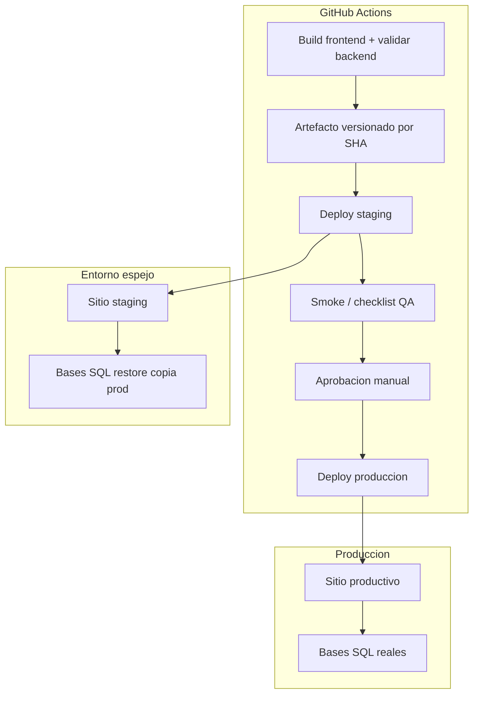

# Addendum — Deploy espejo (staging) antes de producción

| Campo | Valor |
|-------|--------|
| **Ámbito** | Complemento de [Plan A Forge](PLAN-deploy-plan-a-forge-variante-a-github-actions.md) y [Plan B EC2](PLAN-deploy-plan-b-ec2-variante-a-github-actions.md) |
| **Objetivo** | Probar el **mismo artefacto de deploy** contra bases espejo antes de tocar producción |

## Respuesta corta

**Sí, se puede (y conviene) desplegar dos veces en dos sitios distintos** con GitHub Actions:

1. **Build una sola vez** (mismo commit, mismo `public/spa/`, mismo código PHP).
2. **Deploy 1 → staging/espejo** (servidor + bases copiadas de producción).
3. **Pruebas de aceptación** en el espejo (manual + smoke automatizado).
4. **Deploy 2 → producción** (mismo artefacto, distinto host/secrets), con **aprobación humana** obligatoria.

No hace falta correr el pipeline completo dos veces desde cero: lo que se repite es el **job de deploy** (rsync + `release.sh`), no necesariamente `npm run build` otra vez.

---

## Arquitectura recomendada



| Entorno | Servidor | Base de datos | Dominio ejemplo |
|---------|----------|---------------|-----------------|
| **Staging / espejo** | EC2/Forge dedicado (o VM chica) | **Restore periódico** de backup prod (por cliente/tenant) | `staging.pedidosweb.cliente.com` |
| **Producción** | EC2/Forge productivo | Bases en vivo | `pedidosweb.cliente.com` |

Cada entorno tiene su **`.env` propio** (`APP_URL`, `DB_*`, mail deshabilitado o sandbox en staging).

---

## Cómo modelarlo en GitHub Actions

### Opción recomendada — GitHub Environments + promoción

| Environment | Cuándo | Protección |
|-------------|--------|------------|
| `staging` | Push a `v1.1.0` o `workflow_dispatch` | Auto; secrets `STAGING_*` |
| `production` | Tras éxito staging + aprobación | **Required reviewers**; secrets `PRODUCTION_*` |

Workflow simplificado:

```yaml
jobs:
  build:
    # npm run build, upload-artifact (spa + metadata commit)

  deploy-staging:
    needs: build
    environment: staging
    # rsync + release.sh → STAGING_HOST / STAGING_PATH

  verify-staging:
    needs: deploy-staging
    # curl /api/v1/health, opcional smoke Playwright contra URL staging

  deploy-production:
    needs: verify-staging
    environment: production   # aprobación manual en GitHub
    # mismo artifact, PRODUCTION_HOST / PRODUCTION_PATH
```

**Secrets duplicados por prefijo:**

| Staging | Producción |
|---------|------------|
| `STAGING_DEPLOY_HOST` | `PRODUCTION_DEPLOY_HOST` |
| `STAGING_DEPLOY_PATH` | `PRODUCTION_DEPLOY_PATH` |
| `STAGING_DEPLOY_SSH_KEY` (o misma key, distinto user/path) | `PRODUCTION_DEPLOY_SSH_KEY` |

El **build** (`VITE_*`, licencia DevExtreme) es común; puede ir en secrets de repo o environment `staging` reutilizado en job `build`.

### Opción B — Un workflow, input manual de destino

`workflow_dispatch` con choice `staging | production`:

- Operador despliega primero a `staging`, prueba, vuelve a lanzar workflow con `production`.
- Más simple; menos guardrails que Environments con reviewers.

### Opción C — Dos workflows

`deploy-staging.yml` (automático) y `deploy-production.yml` (solo manual, exige commit SHA desplegado OK en staging).

- Clara separación; riesgo de desincronizar artefactos si no se fija el **mismo SHA**.

---

## Bases espejo (SQL Server)

Para “copia de las bases” antes del deploy definitivo:

| Paso | Acción |
|------|--------|
| 1 | **Backup** programado de bases productivas (por tenant/cliente si MONO multi-base) |
| 2 | **Restore** en instancia SQL de staging (nombres distintos, ej. `Ankas_del_sur_STG`) |
| 3 | Ajustar `.env` staging con connection string al restore |
| 4 | Opcional: desactivar mail real (`MAIL_MAILER=log`), flags sandbox |
| 5 | Deploy código a staging → `migrate --force` sobre la copia |
| 6 | QA funcional (login, carga, consultas críticas) |
| 7 | Deploy **mismo commit** a prod → `migrate --force` en prod (migraciones ya validadas en espejo) |

**Importante:**

- El restore debe ser **reciente** respecto al corte de producción que van a desplegar.
- **Nunca** scripts destructivos bootstrap en staging si apunta a un restore con datos reales anonymizados o no.
- Si varias **instalaciones** (varios clientes): staging puede usar **un subconjunto representativo** o un restore por cliente en ventana de prueba.

---

## ¿Es “CD dos veces”?

| Enfoque | Descripción |
|---------|-------------|
| **Sí — promoción de artefacto** | Un build, dos deploys secuenciales (recomendado) |
| **Sí — rebuild idéntico** | Dos pipelines completos mismo commit (desperdicia tiempo; mismo resultado si cache OK) |
| **No recomendado** | Deploy directo a prod y staging en **paralelo** sin gate (doble riesgo, no valida orden) |

La **Continuous Delivery** no exige un solo servidor: exige un **camino repetible** con validación antes de producción.

---

## Checklist QA en espejo (mínimo)

- [ ] `GET /api/v1/health`
- [ ] Login usuario real de prueba (VHS o MVP según entorno)
- [ ] Menú y permisos visibles
- [ ] Flujo crítico negocio (ej. carga comprobante + consulta)
- [ ] Migraciones aplicadas sin error
- [ ] Logs sin excepciones 500 en smoke
- [ ] (Opcional) suite E2E Playwright apuntando a URL staging

Solo tras OK → aprobar job `deploy-production`.

---

## Alternativas si no quieren dos servidores full-time

| Alternativa | Pros | Contras |
|-------------|------|---------|
| **Staging EC2 pequeña siempre on** | Fiel a prod; deploy predecible | Costo fijo mensual |
| **Lightsail staging apagada / snapshot** | Más barato | Arranque manual antes de probar |
| **Restore DB + deploy local contra staging** | Sin segundo sitio público | No prueba Nginx/SSL/rutas reales |
| **Blue/green en un solo server** | Un VM | Dos paths Nginx; **una sola BD** — no sustituye restore espejo |
| **Feature flags** | Rollout gradual | No reemplaza prueba de deploy/migraciones |

Para vuestro caso (crítico, varias instalaciones, SQL Server), **staging dedicado + restore de backup** es la alternativa más sólida.

---

## Cambios sugeridos en los planes A/B

1. Añadir **GitHub Environment** `staging` y `production` en el workflow.
2. Duplicar secrets por entorno (host, path, opcional DB en `.env` server-side).
3. Documentar procedimiento **restore SQL** previo a deploy staging (runbook fuera del pipeline o job manual aprobado).
4. Job `verify-staging` con health + checklist enlazado a [`D-VERIFICACION-101.md`](../../04-tareas/101-PedidosWeb/D-VERIFICACION-101.md) reducido.
5. **Producción:** solo tras `environment: production` aprobada.

---

## Referencia cruzada

- Plan A (Forge): añadir § “Promoción staging → producción” → este documento.
- Plan B (EC2): idem.
