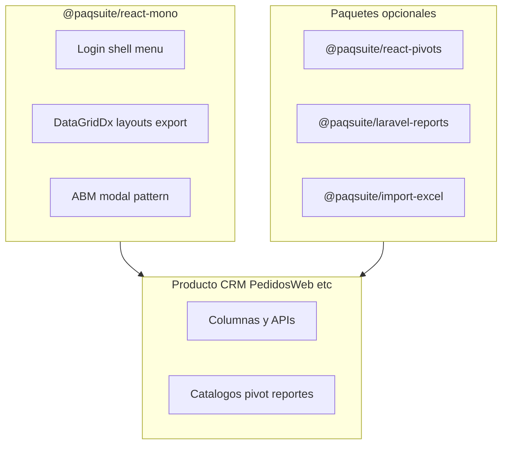
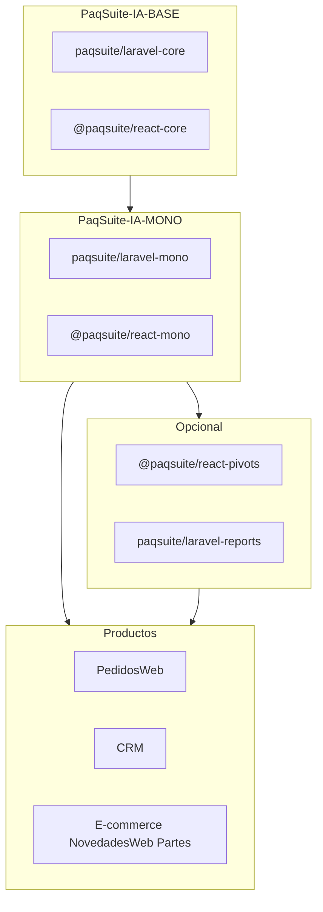

# Framework propio PaqSuite — reutilizar Generalidades entre productos

| Campo | Valor |
|-------|--------|
| **Ámbito** | Plataforma PaqSuite IA — código compartido GEN |
| **Relacionado** | [`symlinks_paqsuite_ia.md`](../symlinks_paqsuite_ia.md), SPEC-001 Generalidades |
| **Donante referencia** | PedidosWeb `v1.1.0-paq` (GEN cerrado en F) |

## Respuesta corta

**Sí.** No hace falta inventar un framework desde cero: ya existe la **capa conceptual** (BASE → MONO → producto) en [`symlinks_paqsuite_ia.md`](../symlinks_paqsuite_ia.md). Falta llevar **el mismo modelo al código ejecutable** hoy embebido en cada producto.

Eso es un **platform SDK** (convenciones PaqSuite + librerías versionadas + scaffold), no un reemplazo de Laravel/React.

---

## ¿Qué se puede encapsular además de login y menú?

**Sí — la mayoría de Generalidades / UI transversal puede encapsularse**, con matices según madurez del SPEC.

| Tema GEN | SPEC / contexto | ¿Encapsulable en framework? | Dónde vive | Qué aporta el producto |
|----------|-----------------|----------------------------|------------|------------------------|
| Login, sesión, contraseñas | SPEC-001-02 | **Sí — núcleo** | `laravel-mono` + `@paqsuite/react-mono` | Tablas `users`, resolver perfil comercial |
| Menú general / sidebar | SPEC-001-01 | **Sí — núcleo** | `@paqsuite/react-mono` | Seed `pq_menus`, rutas lazy dominio |
| Menú avatar (idioma, tema, logout) | SPEC-001-01 | **Sí — núcleo** | `@paqsuite/react-mono` | Preferencias PATCH API |
| Envelope API / errores i18n | BASE | **Sí — núcleo** | `laravel-core` + `@paqsuite/react-core` | Claves `business.*` dominio |
| **Grillas DevExtreme** (`DataGridDx`) | SPEC-001-03 | **Sí — núcleo UI** | `@paqsuite/react-mono` | Columnas, datasource, permisos fila |
| **Layouts de grilla** (guardar/cargar) | SPEC-001-03, HU-GEN-03 | **Sí — núcleo** | `laravel-mono` (API) + `@paqsuite/react-mono` | `proceso`, `grid_id`, columnas default |
| **Exportar Excel** | SPEC-001-03, HU-GEN-03 | **Sí — núcleo** | `@paqsuite/react-mono` (ExcelJS + patrón) | Qué columnas exporta cada grilla |
| **Patrón ABM modal** | SPEC-001-03 | **Sí — núcleo** | `@paqsuite/react-mono` | Formulario y API CRUD dominio |
| **Importar Excel** | SPEC-001-07 | **Sí — patrón + hooks** | `@paqsuite/react-mono` (+ opc. `laravel-core-import`) | Mapeo columnas, validación negocio, endpoint |
| **Pivots / PivotGrid** | SPEC-001-08 | **Sí — motor + extensiones** | Paquete opcional `@paqsuite/react-pivots` + backend pivots | Catálogo campos, consultas, plantillas por producto |
| **Reportes / emisión PDF** | SPEC-001-06 | **Sí — motor + plantillas** | `@paqsuite/laravel-reports` (+ frontend viewer) | Definición reporte, datos, branding |
| Consulta parámetros | TR-GEN-04 | **Sí — componente** | `@paqsuite/react-mono` + servicio base | Tabla `PQ_parametros_gral` por producto |
| Chat asistente IA | SPEC-001-10 | **Sí — shell BYOK** | `@paqsuite/react-mono` (+ backend proxy) | Manuales RAG por producto |
| Tareas programadas | SPEC-001-09 | **Parcial** | `laravel-mono` (scheduler base) | Jobs de negocio en producto |

### Cuadro resumen — qué va en el framework y qué en el producto

| Tema | En el framework | En cada producto |
|------|-----------------|------------------|
| **Grillas** (`DataGridDx`, filtros, agrupación, i18n DX) | Componente + convenciones | Columnas, datasource, acciones de fila |
| **Layouts de grilla** | API + UI guardar/cargar | `proceso`, `grid_id`, layout default |
| **Exportar Excel** | Botón + ExcelJS + patrón | Qué columnas exporta cada listado |
| **ABM modal** | Shell modal DevExtreme | Formulario y API del dominio |
| **Importar Excel** | Patrón reutilizable (Ola 2) | Mapeo columnas y reglas de negocio |
| **Pivots** | Motor + PivotGrid (Ola 3, SPEC-001-08) | Catálogo de campos y consultas |
| **Reportes / PDF** | Motor emisión (Ola 4, SPEC-001-06) | Plantillas y datos por producto |
| **Login / menú / avatar** | Flujos y shell completos | Tablas usuarios, seed menú, perfil comercial |

La tabla anterior detalla SPEC, paquete Composer/npm y matiz de encapsulación por tema.

### Regla de diseño

- **Framework:** comportamiento transversal, contratos, componentes DevExtreme, APIs de layouts/export, motores pivot/reporte **genéricos**.
- **Producto:** definiciones de datos (columnas, endpoints, catálogos pivot, plantillas reporte, textos i18n `pedidos.*`, `crm.*`).

Los temas “autónomos” (login, menú) y los “de presentación de datos” (grillas, Excel, pivots, reportes) **comparten el mismo mecanismo**: paquetes versionados + **extension points**, no copia por repo.

**Prioridad de extracción sugerida:**

1. **Ola 1 (MVP ya hecho):** core + mono — auth, shell, menú, `DataGridDx`, layouts, export Excel, ABM modal.
2. **Ola 2:** import Excel reutilizable (SPEC-001-07).
3. **Ola 3:** motor pivots (SPEC-001-08, hoy documental).
4. **Ola 4:** emisión/reportes PDF (SPEC-001-06).

---

## Estado actual (PedidosWeb como referencia)

| Capa | Qué se comparte hoy | Cómo |
|------|---------------------|------|
| **Docs / OpenSpec GEN** | SPEC-001-* | Symlinks `docs/_base`, `docs/00-contexto/_mono` |
| **Reglas Cursor** | Comportamiento IA | Symlinks `.cursor/rules/base`, `mono` |
| **Código backend GEN** | ApiResponse, Auth, menú, grid layouts… | **Copiado** en `backend/app/` |
| **Código frontend GEN** | client, LoginPage, shell, DataGridDx… | **Copiado** en `frontend/src/` |
| **Dominio** | PedidosWeb, CRM, E-commerce… | Solo en cada repo |

El scaffold [`00-instalacion-scaffold-fullstack.md`](../../00-contexto/_mono/00-instalacion-scaffold-fullstack.md) indica **repetir el patrón** por copia — no escala a 5+ productos sin drift.

---

## Arquitectura objetivo (espejo de docs)

### Paquetes nucleares

**`paqsuite/laravel-core`:** ApiResponse, envelope, OpenAPI helpers, Handler i18n.

**`paqsuite/laravel-mono`:** tenant, auth, menú API, preferencias, **API grid layouts**, seed seguridad transversal.

**`@paqsuite/react-core`:** `apiRequest`, DevExtreme license init, tokens CSS, i18n grid base.

**`@paqsuite/react-mono`:** shell, sidebar, avatar, auth UI, **`DataGridDx`**, layouts UI, **export Excel**, patrón ABM modal.

**Paquetes opcionales (Ola 2–4):**

- `@paqsuite/react-pivots` + backend consultas pivotables (SPEC-001-08).
- `paqsuite/laravel-reports` + visor (SPEC-001-06).
- `@paqsuite/import-excel` (SPEC-001-07).

**Cada producto:** routes/controllers/services dominio; páginas `features/*`; OpenSpec `NNN-Producto` only.

---

## Estrategias de distribución

| Estrategia | Recomendación |
|------------|---------------|
| **A. Paquetes Composer/npm versionados** | **Recomendada** |
| **B. Monorepo platform (Turborepo)** | Fase 2 equipo grande |
| **C. Template + copia** | Estado actual — migrar |
| Symlinks de código | **No** (Windows, CI, deploy) |

---

## Plan de extracción incremental

### Fase 0 — Inventario GEN → paquete

Matriz archivo/TR-GEN → paquete; API pública; semver `1.1.x` alineado plataforma.

### Fase 1 — Backend core + mono (Composer)

Repos `PaqSuite-IA-PHP`: `laravel-core`, `laravel-mono`; ServiceProviders; PedidosWeb consume y elimina duplicados.

### Fase 2 — Frontend core + mono (npm)

Repos `PaqSuite-IA-JS`: `react-core`, `react-mono` (incluye grillas, layouts, export, ABM).

### Fase 3 — Scaffold nuevo producto

Actualizar guía fullstack: `composer require` + `npm install @paqsuite/react-mono`; solo dominio.

### Fase 4 — Segundo producto piloto

CRM o NovedadesWeb; medir líneas dominio vs reutilizadas.

### Fase 5 — Paquetes opcionales

Pivots, reportes, import Excel según roadmap SPEC-001-06/07/08.

---

## Extension points (evitar rigidez)

| Mecanismo | Uso |
|-----------|-----|
| `config/paqsuite.php` | Tenant, prefijo API, tablas transversales |
| Interfaces Laravel | `CommercialProfileResolver`, visibilidad |
| Props / hooks React | `DataGridDx` recibe `columns`, `loadUrl`, `processKey` |
| Catálogos pivot/reporte | JSON o BD por producto; motor común |
| i18n | Paquete: `grid.dx.*`; producto: namespaces dominio |

---

## Riesgos

| Riesgo | Mitigación |
|--------|------------|
| Breaking change GEN | Semver + tests contrato en paquetes |
| Mezclar ERP producto en mono | Paquetes dominio separados (`laravel-pedidosweb` si aplica) |
| Pivots/reportes prematuros | Paquetes opcionales; no bloquear Ola 1 |
| DevExtreme licencia | Secret CI; peerDependency |

---

## Recomendación para debatir

1. **Paquetes versionados** alineados a BASE/MONO docs.
2. **PedidosWeb** como donante Ola 1 (auth + shell + grillas + Excel + layouts).
3. **Cuatro paquetes nucleares** + opcionales pivots/reportes/import.
4. OpenSpec symlinks para docs; paquetes para código.
5. Validar con **segundo producto** antes de Ola 3–4.

---

## Próximo paso

Inventario **GEN → paquete** + PoC: `ApiResponse` + `client.ts` en repos package; rama experimental en PedidosWeb.

---

## Checklist de tareas

- [ ] Inventariar código GEN vs dominio en PedidosWeb (matriz archivo → paquete)
- [ ] Definir repos PaqSuite-IA-PHP y PaqSuite-IA-JS con `packages/`
- [ ] PoC: `paqsuite/laravel-core` + `@paqsuite/react-core`
- [ ] Extraer `laravel-mono` + `@paqsuite/react-mono` (auth, shell, **grillas, layouts, export, ABM**)
- [ ] Actualizar scaffold fullstack; producto piloto CRM/NovedadesWeb
- [ ] (Ola 2+) Paquetes opcionales pivots, reportes, import Excel
