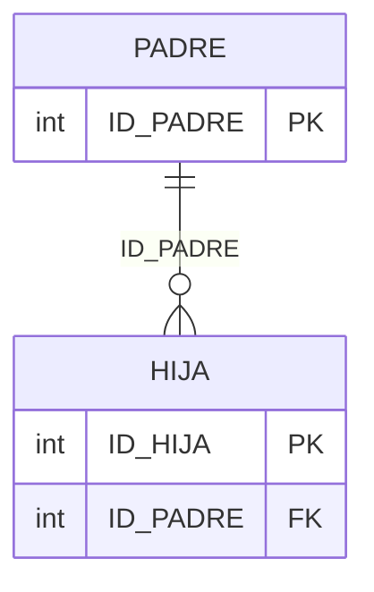

# Diagrama ER (Mermaid) — layout padre → hijas

## Objetivo

Que la **visión gráfica** de todo diagrama `erDiagram` Mermaid presente las **tablas padres por encima** de las tablas hijas (jerarquía de arriba hacia abajo).

Aplica al crear o actualizar secciones **«Diagrama ER (Mermaid)»** en documentación de modelo de datos u otros docs técnicos del monorepo (BASE / MULTI / TANGO).

## Reglas obligatorias

1. **Dirección vertical**
   - Incluir `direction TB` al inicio del bloque `erDiagram`.

2. **Sentido de las relaciones**
   - Escribir siempre **padre → hijas**: `PADRE ||--o{ HIJA : "FK"`
   - **No** escribir la relación al revés (`HIJA }o--|| PADRE`), porque el layout suele invertir el árbol.

3. **Orden de declaración**
   - Declarar primero la(s) entidad(es) raíz / padre.
   - Luego hijas directas.
   - Luego nietas / subárboles.
   - Al final, tablas externas de referencia (catálogos, maestros compartidos).

4. **Cardinalidad**
   - Mantener la cardinalidad real del modelo (`||--o{`, `|o--o{`, etc.); solo se fija el **sentido** padre→hija y el `direction TB`.

## Plantilla mínima

## Notas

- El motor Mermaid **no garantiza** el 100 % del layout (sobre todo con muchas FKs cruzadas a tablas externas). Si el preview queda ilegible, complementar con una vista jerárquica `flowchart TB` **además** del `erDiagram`, sin reemplazarlo.
- Esta regla **no** altera esquemas de BD ni scripts `CREATE`; solo la documentación gráfica Mermaid.
